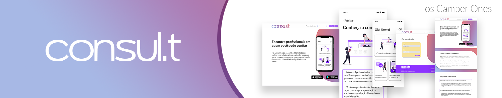

# Consul.t
 Canal de indicação e validação de profissionais que atendem pessoas trans. Projeto desenvolvido durante o Ioasys CAMP 2021

# :pushpin: Table of Contents

* [Features](#brain-features)
* [Preview](#eye-preview)
* [Technologies](#computer-technologies)

# :brain: Features

* Usuário pode criar uma nova conta
* Usuário pode fazer login
* Usuário pode fazer signout
* Usuário pode ver/alterar informações da conta
* Usuário pode ver listagem de profissionais
* Usuário pode ver detalhes do profissional
* Usuário pode solicitar consulta com profissional
* Usuário pode ver histórico de consultas
* Usuário pode ver status de cada consulta
* Usuário pode ler sobre o projeto
* Usuário pode usar filtros na listagem de profissionais 🚧 WIP 🚧
* Usuário pode avaliar consultas realizadas 🚧 WIP 🚧

# :eye: Preview

# :computer: Technologies

* Kotlin
* Retrofit
* Dagger Hilt
* Navigation components
* DataStore
* Coroutines
* Data Binding
* MVVM
* ...
